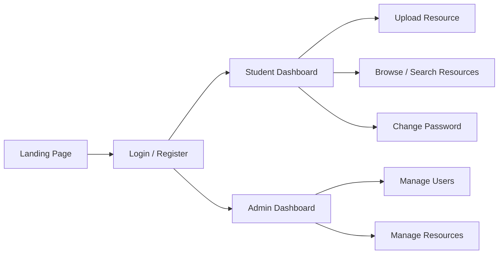
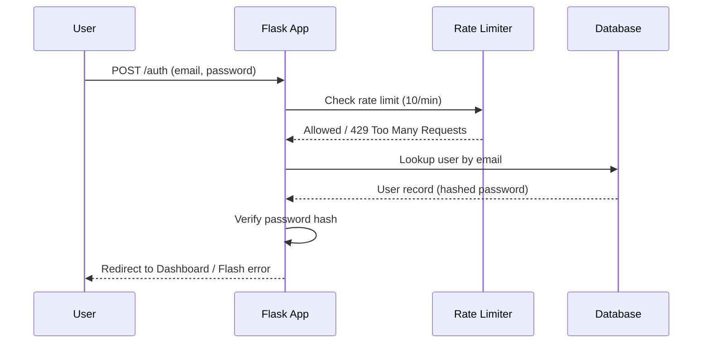
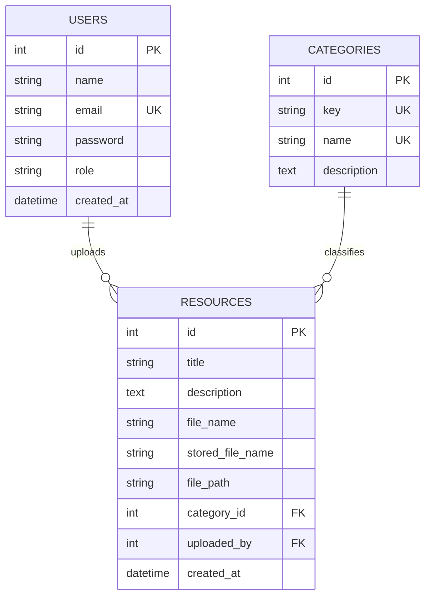
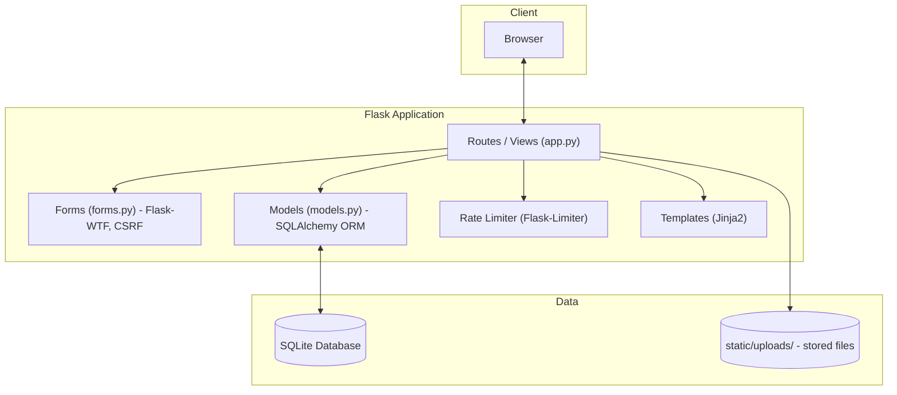

# StudentLearningHub — Design & Architecture Submission

## 1. Project Overview

**StudentLearningHub** is a web application built with Flask that allows students to share and discover academic resources (practicals, project source code, seminar PPTs, documentation, coding practice material, interview prep, resume templates, and useful links). Students can register, upload resources, browse/search/filter existing resources, and manage their account. Admin users can moderate resources and manage users.

**Tech Stack:**
- Backend: Flask 3.1.0, Flask-SQLAlchemy 3.1.1, Flask-WTF 1.2.2, Flask-Limiter 4.1.1
- Frontend: Jinja2 templates, vanilla CSS
- Database: SQLite
- Testing: Pytest

---

## 2. Frontend Design Prototype

The prototype is a fully working set of server-rendered screens rather than a static mockup:

- **Landing Page** — introduces the platform
- **Login / Register** — authentication forms with CSRF protection
- **Student Dashboard** — quick links, includes a "Change Password" disclosure panel
- **Upload Resource** — form to submit a new resource with category selection
- **Browse / Search Resources** — search by keyword, filter by category, paginated (12 per page)
- **Admin Dashboard** — manage users and resources, paginated resource list
- **Change Password** — requires current password verification

### User Flow

### Design Notes
- Consistent layout via a shared `.content-shell` CSS wrapper class
- Flash messages (`.flash-*` classes) for user feedback on every action
- Search/filter selections persist across pagination via query parameters
- Custom error pages for 404 / 403 / 429 / 500 (instead of default Flask error screens)

---

## 3. Business Logic

| Feature | Business Rule |
|---|---|
| Registration | Email must be unique; password is hashed before storage (never stored in plain text) |
| Login | Rate-limited to 10 attempts per minute per IP to mitigate brute-force attacks |
| Resource Upload | Uploaded files are renamed to a generated `stored_file_name` (not the original filename) to avoid collisions and path traversal issues |
| Resource Browsing | Supports keyword search (title/description), category filter, and pagination (12 results/page) |
| Roles | Two roles — `student` and `admin`. Admin-only routes are protected at the route/server level, not just hidden in the UI |
| Password Change | Requires the current password to be verified before a new password is accepted |
| CSRF Protection | Every state-changing form (login, register, upload, contact, password change) includes a CSRF token validated via Flask-WTF |
| Error Handling | Centralized error handlers for 404 (not found), 403 (forbidden), 429 (rate limited), and 500 (server error) |

### Example: Authentication Flow

---

## 4. Database Design & Architecture

The application uses a normalized 3-table relational schema.

### Entity-Relationship Diagram

### Design Rationale
- **Normalization**: `Category` is a dedicated table rather than a free-text field on `Resource`, so category names can be renamed/managed without touching every resource row.
- **Referential Integrity**: `Resource.category_id` and `Resource.uploaded_by` are foreign keys, preventing orphaned resource records.
- **Stable lookup key vs. display name**: `Category.key` (e.g. `"practical"`) is a stable machine identifier used internally (form choices, seeding), while `Category.name` is the human-readable label — decoupling the two avoids breaking lookups when a category is renamed.
- **Single Source of Truth**: A `CATEGORY_SEED` constant defines the built-in categories once and is used both to seed the database and to populate the upload form's dropdown, preventing drift between the two.

---

## 5. Architecture Overview

---

## 6. Security & Quality Highlights

- Password hashing (no plain-text password storage)
- CSRF protection on all state-changing forms
- Rate limiting on authentication endpoint
- Server-side role enforcement for admin routes
- Custom error pages instead of default framework error screens
- Debug mode gated behind an environment variable (`FLASK_DEBUG`), disabled by default in production
- Automated test suite (Pytest) covering core flows

---

## 7. Future Scope

- Forgot-password / password-reset flow (currently only in-session password change is supported)
- Profile editing (update name/email after registration)
- File type/size validation hardening on uploads
- Move from SQLite to a production-grade RDBMS (e.g. PostgreSQL) for deployment

---

## 8. Suggested Submission Structure

1. Title slide — project name, author, tech stack
2. Problem statement — what gap this fills
3. Architecture diagram (Section 5)
4. Frontend screens / walkthrough (Section 2)
5. Business logic table (Section 3)
6. ER diagram (Section 4)
7. Security highlights (Section 6)
8. Live demo / GitHub repository link
9. Future scope (Section 7)
